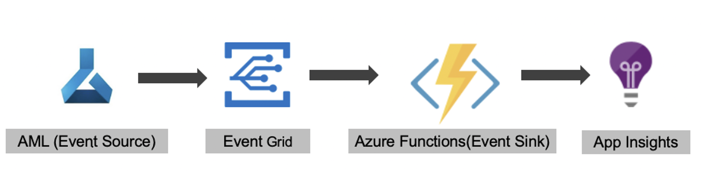

# Azure Machine Learning(AML) Pipeline Run Observability

Here is the approach which we can use to record metrics about an Azure Machine Learning Pipeline Run. We will be using an event driven approach as Azure Machine Learning has a [well defined integration](https://docs.microsoft.com/en-us/azure/machine-learning/how-to-use-event-grid) with Azure Event Grid for machine learning events.

## Overview



* As shown in the above image Azure Machine Learning is an event source and Azure Function is an event sink here. All of these Machine learning events will be published & consumed via Azure Event Grid. Inside Azure Function we can record this pipeline run metrics to Azure Application Insights or to any other data/metric store of your choice.

* For every Azure Machine Learning pipeline run it will publish an event on Azure Event Grid.

* Event Grid event schema is defined [here](https://docs.microsoft.com/en-us/azure/event-grid/event-schema-machine-learning#event-grid-event-schema).

## How To Publish ML Events to Event Grid

* To setup Event Grid integration using Azure portal please follow given instructions [here](https://docs.microsoft.com/en-us/azure/machine-learning/how-to-use-event-grid#set-up-in-azure-portal).

* To setup Event Grid integration using Azure Cli please follow given instructions [here](https://docs.microsoft.com/en-us/azure/machine-learning/how-to-use-event-grid#set-up-with-the-cli).

* Azure Machine Learning provides events in the various points of machine learning lifecycle. See them [here](https://docs.microsoft.com/en-us/azure/machine-learning/how-to-use-event-grid#event-types-for-azure-machine-learning).

* You can also filter these events. See [here](https://docs.microsoft.com/en-us/azure/machine-learning/how-to-use-event-grid#filter--subscribe-to-events)

## About Azure Function

* Azure Function plays an important role here as Azure Event Grid has a native integration with Azure Function so this Azure Function will be triggered automatically as soon as we will be  receiving an AML pipeline run event. Inside this Azure Function code we are using `Azure ML SDK` to get further details about a particular Machine learning run based on `runId`. This `runId` we get in the body of incoming event json.

* A sample Azure Function with this functionality is [here](azure_function_sample).

* Once we have the required metrics we can store them in Azure Application Insights or somewhere else for further analysis.

## Few Examples for Event Grid event data & Metrics

* Here is an example of an incoming event data for an Azure Machine Learning `Pipeline Run` status `Completed`.

```json
{
	"id": "9168ed-fb6f-5514-a60e-bb503a04",
	"data": {
		"runStatus": "Completed",
		"experimentId": "eea3758a-4a75-42a7-b215-32739323a0a7",
		"experimentName": "experimentName",
		"runId": "129a171f-bc8d-4e0a-bd51-8fa2e8b94b35",
		"runType": "azureml.PipelineRun",
		"runTags": {
			"azureml.Designer": "true",
			"azureml.pipelineComponent": "pipelinerun"
		},
		"runProperties": {
			"azureml.runsource": "azureml.PipelineRun",
			"runSource": "Designer",
			"runType": "HTTP",
			"azureml.parameters": "{}"
		}
	},
	"topic": "/subscriptions/38e0c6f9-393e-413e-9d17-6e95dc2b5a5b/resourceGroups/sample/providers/Microsoft.MachineLearningServices/workspaces/sample-ws",
	"subject": "experiments/eea3758a-4a75-42a7-b215-32739323a0a7/runs/129a171f-bc8d-4e0a-bd51-8fa2e8b94b35",
	"event_type": "Microsoft.MachineLearningServices.RunStatusChanged"
}
```

* Here is an example of an incoming event data for an Azure Machine Learning `Pipeline Step Run` status `Completed`.

```json
{
	"id": "8d2173-908c8-5785-9sa1d-da3922c2",
	"data": {
		"runStatus": "Completed",
		"experimentId": "eea3758a-4a75-42a7-b215-32739323a0a7",
		"experimentName": "experimentName",
		"runId": "9a9d8f51-1e44-4c23-b0a0-8246046eeb28",
		"runType": "azureml.StepRun",
		"runTags": {
			"azureml.pipeline": "775ff4ae-c312-4533-b8df-d04a1ec09246",
			"azureml.pipelinerunid": "096a41be-218d-4bdb-857d-be3222caa891",
			"azureml.nodeid": "254c70df"
		},
		"runProperties": {
			"azureml.runsource": "azureml.StepRun",
			"azureml.nodeid": "254c70df",
			"contentSnapshotId": "119c3ec1-9e46-46d2-8236-5f533e84a799",
			"stepType": "PythonScriptStep",
			"computeTargetType": "AmlCompute"
		}
	},
	"topic": "/subscriptions/38e0c6f9-393e-413e-9d17-6e95dc2b5a5b/resourceGroups/sample/providers/Microsoft.MachineLearningServices/workspaces/sample-ws",
	"subject": "experiments/eea3758a-4a75-42a7-b215-32739323a0a7/runs/9a9d8f51-1e44-4c23-b0a0-8246046eeb28",
	"event_type": "Microsoft.MachineLearningServices.RunStatusChanged"
}
```

* As explained above in [Azure Function section](#about-azure-function) we can then use `Azure ML SDK` to fetch further details about this AML run and after merging these further details with event details here is an example of what overall observability metrics data will look like.

```json
{
	"compute_target_type": "AmlCompute",
	"execution_time_ms": "111",
	"start_time_utc_ms": "1591557375869",
	"end_time_utc_ms": "1591557375980",
	"experimentName": "experimentName",
	"pipelinerunid": "096a41be-218d-4bdb-857d-be3222caa891",
	"docker_image": "mcr.microsoft.com/azureml/base:intelmpi2018.3-ubuntu16.04",
	"experimentId": "eea3758a-4a75-42a7-b215-32739323a0a",
	"resourceGroup": "sample",
	"subscriptions": "38e0c6f9-393e-413e-9d17-6e95dc2b5a5b",
	"amlWorkSpace": "sample-ws",
	"snapshot_id": "119c3ec1-9e46-46d2-8236-5f533e84a799",
	"step_type": "PythonScriptStep",
	"run_type": "azureml.StepRun",
	"node_id": "254c70df",
	"run_id": "9a9d8f51-1e44-4c23-b0a0-8246046eeb28",
	"target": "sample-compute",
	"script": "sampleStep.py",
	"status": "Completed"
}
```

## Benefits of Event Driven Approach

* Metrics recording is decoupled from Machine Learning code.

* Resilient against pipeline (or pipeline step) failures and AML compute failure.

* Able to record run metrics in all pipeline runs e.g. manual pipeline trigger ML studio, code trigger , CI trigger etc.

## Environment variables used in sample code

* This Sample code expects few environment variables to be defined.

  * For authentication it usages Service Principal Authentication which expects environment variable like `TENANT_ID`, `APP_ID` & `SERVICE_PRINCIPAL_PASSWORD`.

  * Workspace details as `SUBSCRIPTION_ID`, `AML_RESOURCE_GROUP` & `AML_WORKSPACE_NAME`.

  * Azure Application Insight connection string as `APPINSIGHTS_CONNECTION_STRING`. It looks like this `InstrumentationKey=xxxx-xxxx-xxx-xxx-xxxx`

* Information on how to create Service Principal can be found [here](https://docs.microsoft.com/en-us/azure/active-directory/develop/howto-create-service-principal-portal).

* For a much better security & management please consider to use [Azure Key Vault](https://azure.microsoft.com/en-us/services/key-vault/) for storing & accessing any secret information e.g. passwords.
